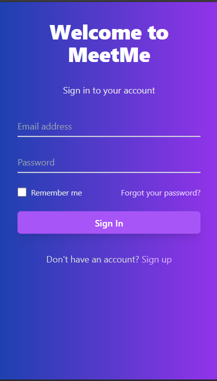
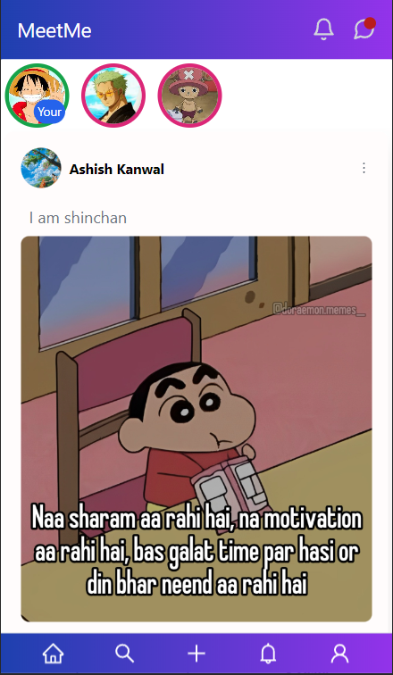
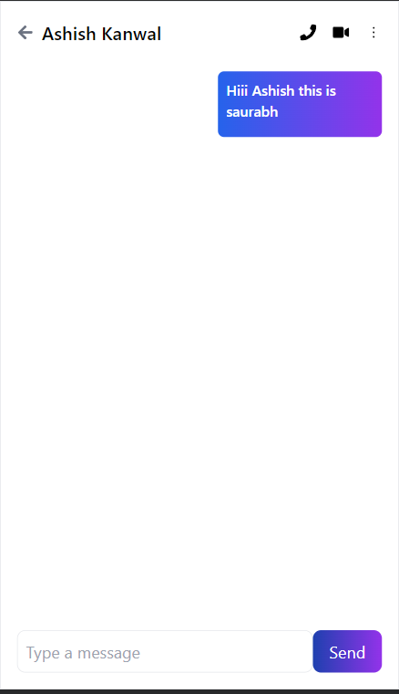
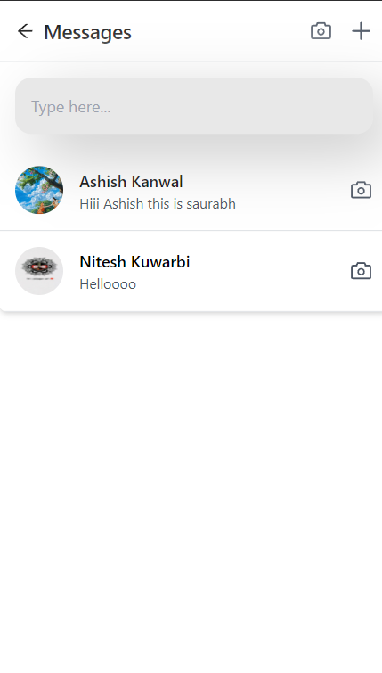
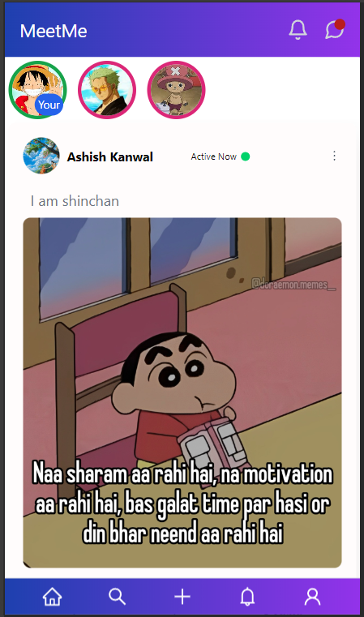
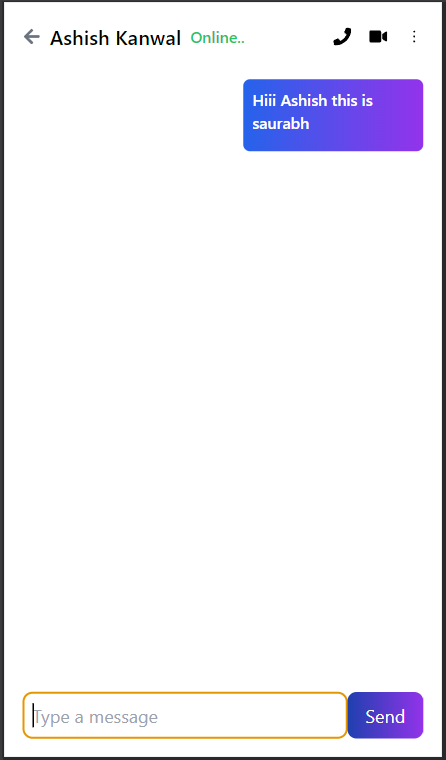
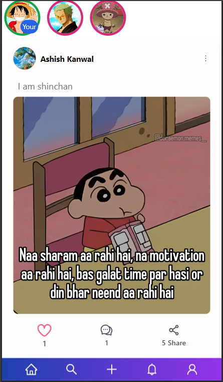
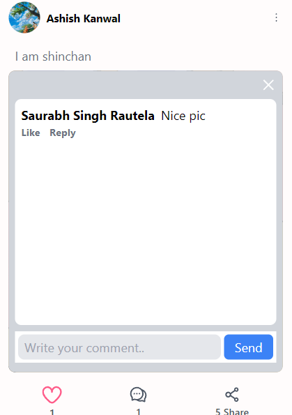

# MeetMe

## Description
Our Social Media Web Application is designed for mobile devices, offering a seamless and engaging experience. Users can easily create accounts, connect with friends, and share their thoughts through posts. The platform allows for real-time chatting with friends, along with the ability to like and comment on posts. Users can also send and accept friend requests, making it easy to expand their social network. With a focus on user interaction and community building, this application provides all the essential features for a rich social media experience on mobile. This is just the beginning, as more exciting features will be added in the future to enhance the user experience.

## Some Screenshots 

### Login Page

This is Login and Signup Page user can create his account using Singup button .

### Home Page

The Home Page contains all the user posts and a user can like and comment to the other user posts.
Also User can navigate to other page using footer navbar.

### Chat Page

This page shows the chat of two friends.

### Inbox Page

Inbox page shows recent messages of all friends.

## When Friend is Active

## Upload

## Post

## Post

## How to run
First Clone the Repo then install required packages.
For frontend: npm i react-router-dom react-icons socket-io concurrently 
For backend : npm i express mongoose socket-io jsonwebtoken express-session cors dotenv config 
Before running the app check your env vairables and setup according to your need.
You need a Monogdb compass in your system to store and check the data locally.

## License
All right reserved by Saurabh Singh Rautela.
